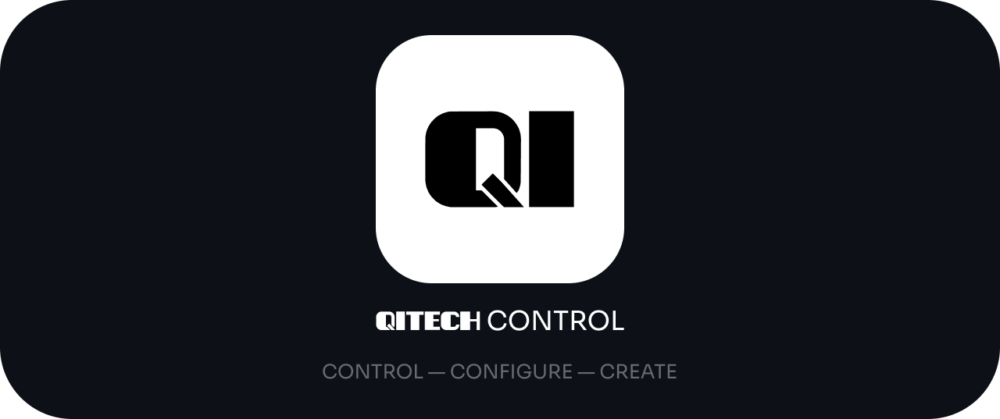

# QiTech Control
QiTech Control is an industrial control panel software for the next generation of QiTech recycling machines built on top of Beckhoff Automation hardware.

# Repo Structure

Frontend
- `/electron`: Frontend code for the control software built with React and Electron.

Backend
- `/server`: Glue between Beckhoff and Electron. Implements machine logic.
- `/stepper-driver`: Generic stepper driver for absolute, relative & speed movements with PID controllers.
- `/ethercat-hal`: Hardware abstraction layer for Beckhoff (and possibly other EtherCat) devices and protocols.
- `/ethercat-hal-derive`: Macros for `ethercat-hal`
- `/control-core`: Core control logic for the server.

Operating System
- `/nixos`: Custom Linux with realtime kernel & preconfigured for touchscreens.

Other
- `/docs`: Documentation for the project.

# Technology Choices

# Dev Setup

# Machines

| Machine Type | Version | Release Date | Description                 | Change to Previous Version                             | Vendor ID                  | Machine ID | Implemented | Docs                            |
| ------------ | ------- | ------------ | --------------------------- | ------------------------------------------------------ | -------------------------- | ---------- | ----------- | ------------------------------- |
| Winder       | V1      | ???          | Winding Filaments & Similar | -                                                      | 1 (Qitech Industries GmbH) | 1          | Reserved    | -                               |
| Winder       | V2      | 2025         | Winding Filaments & Similar | Reengineered Traverse                                  | 1 (Qitech Industries GmbH) | 2          | In Progress |  |
| Extruder     | V1      | ???          | Single Screw Extruder       | -                                                      | 1 (Qitech Industries GmbH) | 3          | Reserved    | -                               |
| Extruder     | V2      | 2025         | Single Screw Extruder       | PT100 Thermometers, Optional Additional Heating Zone 4 | 1 (Qitech Industries GmbH) | 4          | Not Yet     | [                               |
| Waterway     | V1      | 2025         | Filament Water Cooling      | -                                                      | 1 (Qitech Industries GmbH) | 5          | Not Yet     |                                 |

# More Docs

- [X] [Architecture & Data Flow](./docs/architecture-overview.md)
  - [X] Example Winder V2

- [ ] Electron
  - Folder Structure 
  - Routing with TanStack Router
  - Design with Tailwind & Shadcn 
  - ...

- [ ] Interfacing with Electron/Server
  - [ ] SocketIO
    - Rooms & Caching
    - Joining leaving rooms
    - RoomId
    - Our rooms vs native socketIO rooms
    - Caching
      - Serverside Caching
      - Clientside Caching
    - Machine Room
    - Main Room
  - [ ] REST
    - Machine Mutations
    - Write Device Identification

- Server
  - [ ] Control Loop Setup
    - Control Loop Thread
      - [ ] realtime
    - Maindevice
    - Group
    - Extracting Device Identifications
    - Identifying Groups
    - Validating Machines
    - Run Control Loop
  - [ ] Control Loop
    - Ethercat TX/RX
    - Reading Inputs
    - Calling Actors
    - Writing Outputs
  - [ ] Machine/Device Identification
    - SubDevice Identity
    - Identification design choices
    - Machine/Device Identification Values
    - Device Identification with EEPROM
    - Grouping Devices
    - Validating Device Groups to Machines
    - How to: Identify a New Device
      - Find free EEPROM words
      - Get identity values and add them to pattern matching
  - [ ] Machines
    - When to create a new Machine?
      - Versioning
      - Code sharing
    - Creating/Validating a Machine
      - Validation
      - Configuration
  - [ ] Machine Implementation Guide
    - Link: How to create a Device
    - Link: How to create an Actor
    - Link: How to create a Machine
      - API (SocketIO + REST)
      - Creation/Validation Logic
        - Optional/Mandatory Devices
        - Validate Devices
      - Business Logic
    - Link: How to create Machine Abstraction (Like Traverse/Puller/...)
    - Forward `act` in winder.

- [ ] Control Core
  - [ ] Actors

- [X] Ethercat HAL
  - [X] [Devices](./docs/devices.md)
  - [X] [Configuration (CoE)](./docs/coe.md)
  - [X] [IO](./docs/io.md)
  - [X] [PDO](./docs/pdo.md)

- [X] [Ethercat Basics](./docs/ethercat-basics.md)

- [ ] Operating System
  - Why
  - How