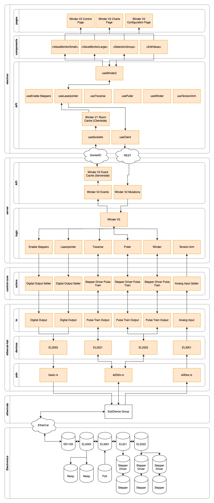

# Architecture Overview

## The Application is Split Into 3 Main Layers
- **Electron**: Electron frontend
  - Tasks
    - UI
    - API Interface Clientside
    - Persisting User Config
  - Technology
    - Programming Language: TypeScript
    - Framework: React
    - Routing: TanStack Router
    - Styling: Tailwind CSS / Shadcn (Radix UI Wrapper)
    - State Management: Zustand, Immer
- **Server**
  - Tasks
    - Control Loop
    - API Interface Serverside
    - Machine Discovery
    - Machine Logic
  - Technology
    - Programming Language: Rust
    - Framework: Axum
    - Async: Smol
- **Control Core**
  - Dependency of the Server 
  - Tasks
    - Generic Logic
    - Device Identification
    - Actors
- **Ethercat HAL**
  - Dependency of the Server
  - Tasks
    - Coding/Decoding Device Process Data (PDO)
    - Configuring Ethercat Devices via CoE
    - Defining Device Ports and IO
    - Basic Structs for Control Loop
      - `Actor`
      - Basic Actors like `DigitalOutputSetter`, `AnalogInputGetter`, `StepperDriverPulseTrain`.
    - IO Primitives
      - `DigitalInput`
      - `DigitalOutput`
      - `AnalogInput`
      - `AnalogOutput`

## Electron
The electron app contains the UI pages for all machines. They all use simple UI components like `<EditValue>` to interface with the backend in a very standardized way.

It also implements a series of hooks to bundle all getters and setters for the UI in a single hook. Under the hood SocketIO is used to read values and REST is used to write values.

## Server
The server holds the control logic for the machines and splits it into several parts. The Winder V2 is divided by its attached hardware functionality like traverse, puller, winder (which are motors), the tension arm which is an analog input & some digital outputs.

# Control Core
The control core holds the generic code of the server which could be reused for ther servers.

## Ethercat HAL
Ethercat HAL implements a couple of abstraction layers for minimal code duplication and different levels of data. The lowest level is the PDO level which interprets the bit vector that contains the input and outputs of each cycle. The PDO implementations convert these bits to variables of type bool, u16, f32 or more. Many devices have the same or similar PDOs like the digital Output devices with different amount of channels: EL2002 (2 Channels), EL2004 (4 Channels), EL2008 (8 Channels).

The devices store the timestamps and the most recent data. They implement different IO types. Every device can also be configured with CoE (CAN over Ethercat) to set the device parameters.

The IO layer makes it simple to build generic functionality on top. It's not important for the logic of a machine if it has 1x 8-channel digital output or 4x 2-channel digital outputs. It's all `DigitalOutput`.

Actors are the next layer. They have two main functions: Add more semantic value for the raw data of the IO layer and implement the actor trait. The `ethercat-hal` contains basic actors but they could also be defined in the server or anywhere else. The `Actor` trait exposes the function `act` which is executed once a cycle. In contrast the IO layer is just a stateless getter/setter.