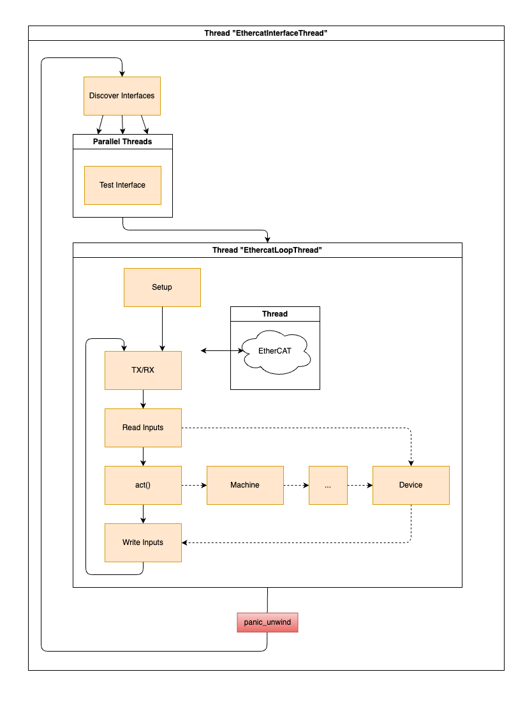

# Control Loop

## TX/RX
The control loop starts with the TX/RX handled by Ethercrab. It sends the EtherCat frome to all devices and waits for recieval.
Although EtherCAT supports multiple in-flight frames we just use one at a time.

## Read Inputs
We loop over every device and check if the inputs for this device match the expected length (byte length).

If the size matches we give the inputs to the `TxPdo` object of the device which will decode and store the inputs.

## Act
We loop over all known actors and call their `act` function. This is where the control loop logic happens. They can read the input and write the output.

## Write Outputs
We loop over every device and check if the outputs for this device match the expected length (byte length).

If the size matches we give the outputs to the `RxPdo` object of the device which will encode the outputs.

