# Minimal Example — LED Control on the EL2004  
A complete hardware + software walkthrough

---

## Table of Contents
1. [Introduction](#1-introduction)  
2. [Requirements](#2-requirements)  
3. [Hardware Setup](#3-hardware-setup)  
4. [Software Setup](#4-software-setup)  
5. [Demo](#5-demo)  
6. [References](#6-references)  
7. [Acknowledgements](#7-acknowledgements)

---

## 1. Introduction

The EL2004 LED Toggle Example is a minimal demonstration showing how to control digital outputs on a **Beckhoff EL2004 EtherCAT terminal** using the QiTech machine framework.  
It represents the simplest possible hardware interaction in the system:  
**toggling LED outputs using the QiTech Control Dashboard.**

---

## 2. Requirements

### Hardware
- Beckhoff **EL2004 EtherCAT Terminal** (4-channel digital output)  
- Beckhoff **EK1100 EtherCAT Coupler**  
- **24 V DC power supply** (AC/DC adapter + DC hollow plug)  
- Jumper / bridge wires (0.5–1.5 mm² recommended)  
- A **Linux PC** (Ubuntu/Debian recommended)  
- Standard Ethernet cable  
- Flat screwdriver  

### Software  
*(Installation steps in Section 4)*  
- Rust toolchain  
- Node.js + npm  
- Git  
- QiTech Control repository  
- EtherCAT HAL (included inside repo)

---

## 3. Hardware Setup

### 3.1 Schematic

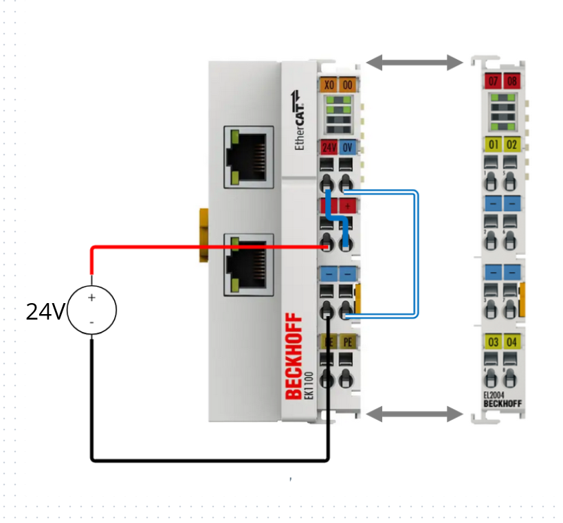

---

### 3.2 EK1100 Wiring

This wiring configuration powers the EL2004 and prepares it for LED control.  
It is not the only possible wiring but is the **simplest functional setup**.

#### ⚠️ Safety Warning  
Always disconnect power before wiring.  
Working on live EtherCAT terminals can cause serious damage or electrical shock.

---

#### 3.2.1 Safe Wiring Procedure (Beckhoff Recommended)

1. Insert a screwdriver **straight** into the square release hole.  
2. Insert the stripped wire into the round opening.  
3. Remove the screwdriver — the spring clamp locks the wire.

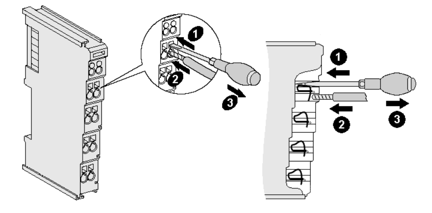

---

#### 3.2.2 Wiring Steps (Used in This Example)

We supply power using a **DC hollow-plug adapter**, like this one:  
https://www.amazon.de/dp/B093FTFZ8Q

Perform the following wiring on the EK1100:

1. Red wire **(+24 V)** → Terminal **2**  
2. Black wire **(0 V)** → Terminal **3**  
3. Jumper wire from **Terminal 1 → Terminal 6**  
4. Jumper wire from **Terminal 5 → Terminal 7**  

After wiring, your module should look like **Figure 1**.

---

#### **Figure 1 — EK1100 Minimal Wiring**
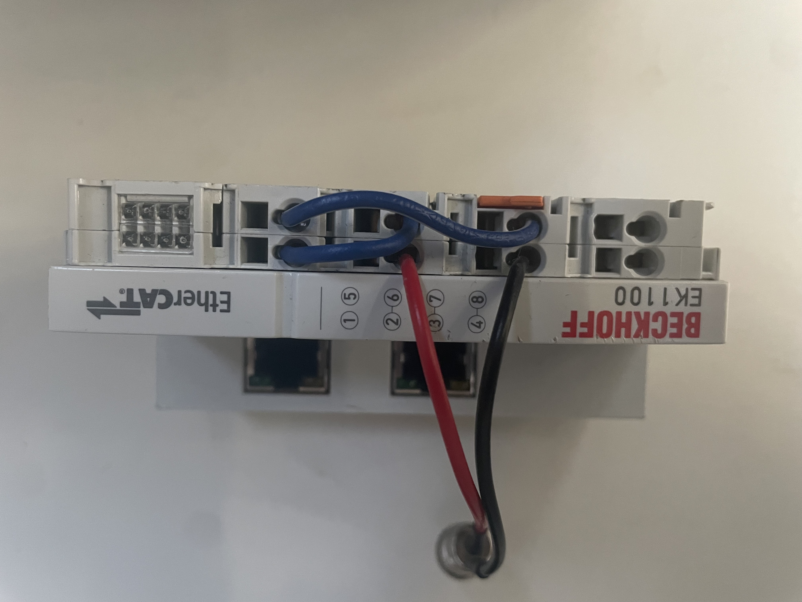


---

### 3.3 EL2004 Integration

Slide the EL2004 onto the **right side of the EK1100** until it locks.  
The EtherCAT E-Bus and power contacts connect automatically — **no wiring required**.

#### **Figure 2 — EL2004 Terminal**
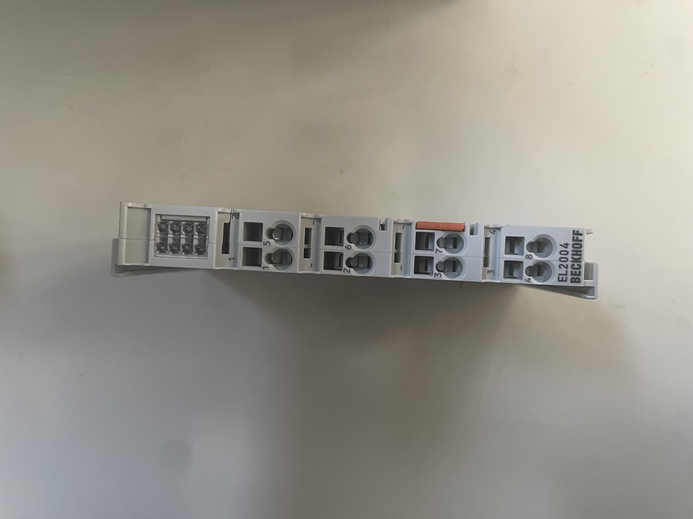

---

### 3.4 Final Assembled Setup

#### **Figure 3 — EK1100 + EL2004 Connected**
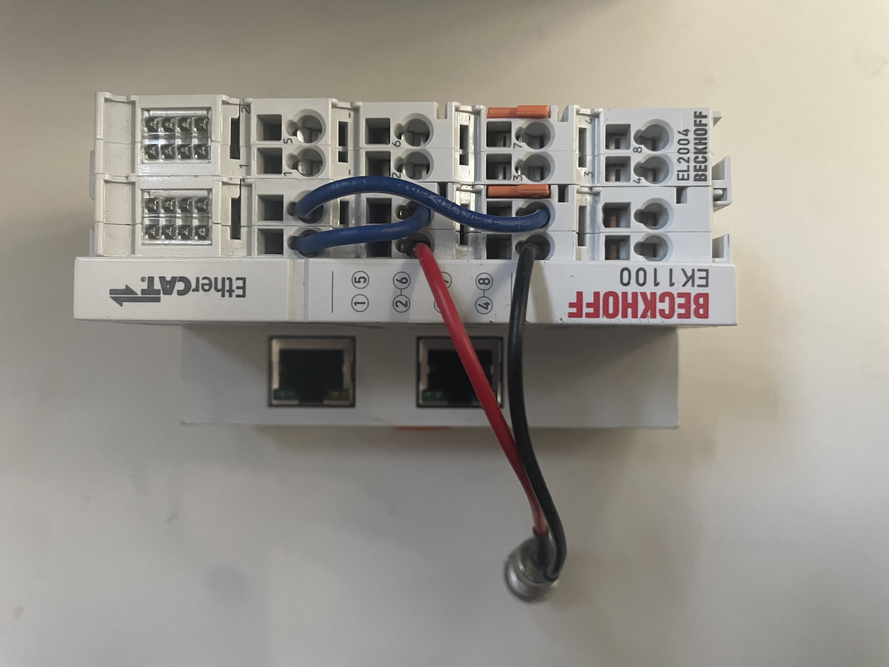

---

### 3.5 Power & Ethernet

#### Power  
Connect the 24 V adapter to the hollow plug used earlier.
**Example AC/DC Adapter (Figure 4):**

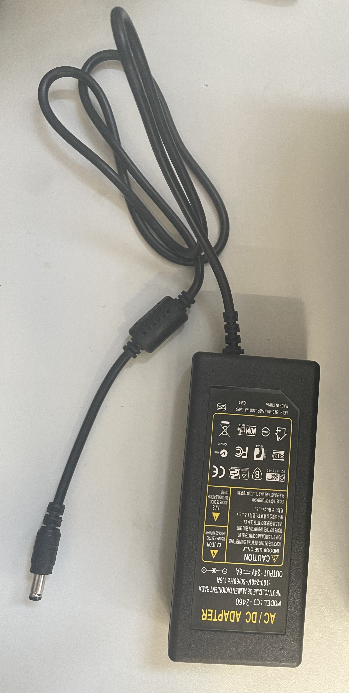


#### Ethernet  
Use a standard LAN cable to connect your PC → EK1100.
The final powered up and connected setup should look like this:

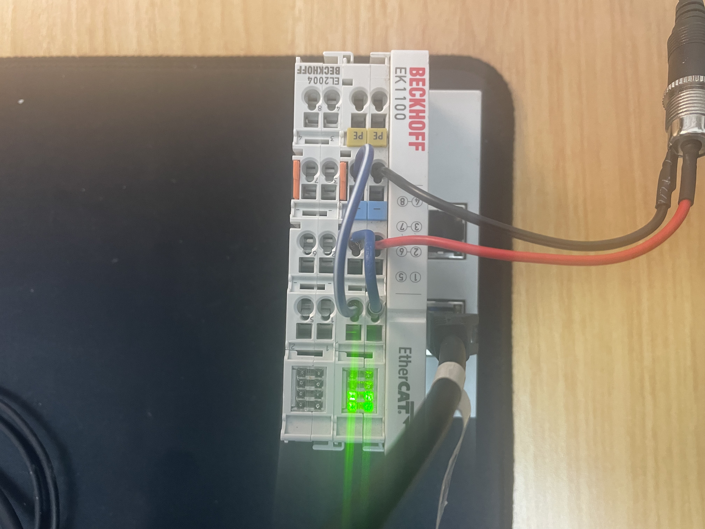

---

## 4. Software Setup

### 4.1 Installing on Ubuntu/Debian

Paste this into your terminal:

```bash
# Press Enter when prompted
curl --proto '=https' --tlsv1.2 -sSf https://sh.rustup.rs | sh

sudo apt update
sudo apt install -y npm nodejs git

git clone git@github.com:qitechgmbh/control.git
cd control/electron
npm install
```
### 4.2 Running the Backend
```bash
./cargo_run_linux.sh
```
This script:

- Builds the backend

- Grants required system capabilities (raw sockets)

- Starts EtherCAT communication

Ensure the EK1100 is connected.

### 4.3 Running the Frontend
```bash
cd electron
npm run start
```
This launches the QiTech Control dashboard.

## 5. Demo

### 5.1 Assigning Devices in the Dashboard

Once the backend + frontend are running, you should see:

- EK1100 Coupler

- EL2004 Digital Output Terminal
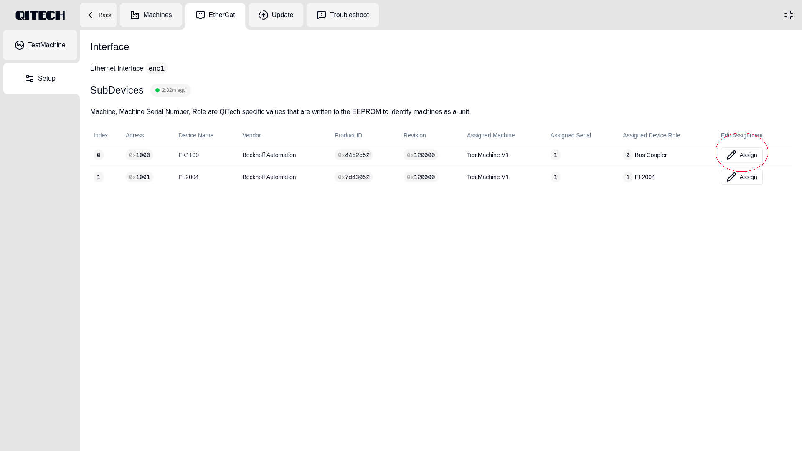

Steps:

- Click Assign on the EK1100

- Select TestMachine V1
 
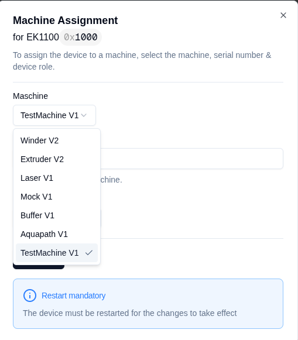


- Enter a serial number (use the same for EK1100 + EL2004)

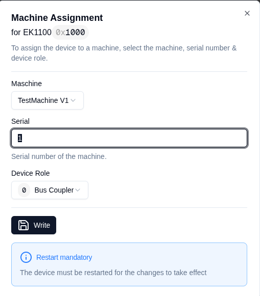

- Click Write

- Repeat for the EL2004

### 5.2 Testing LED Control
Navigate to:

Machines → TestMachine
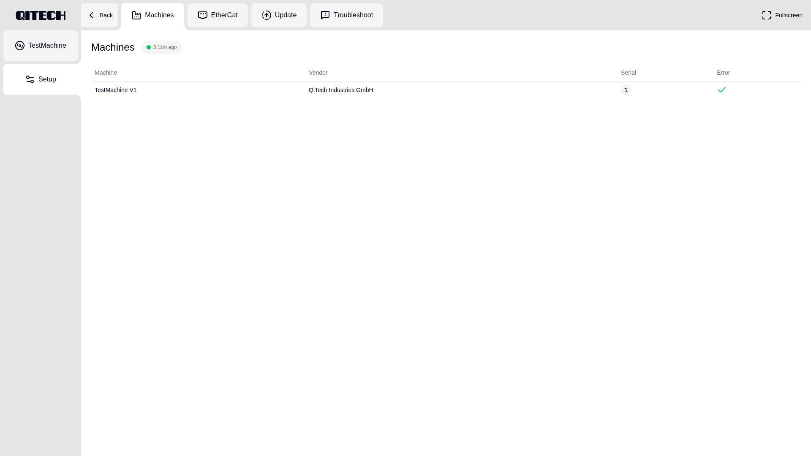
You will see this interface:

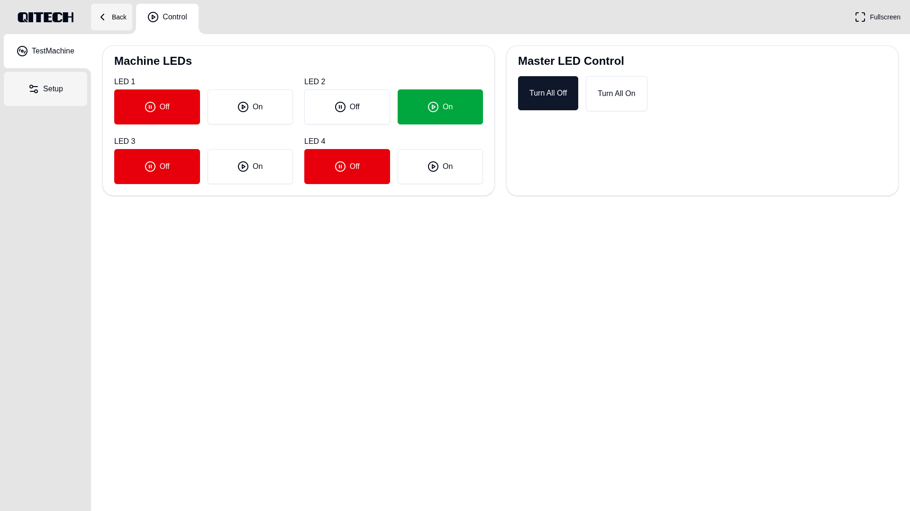

**You can now toggle the four digital outputs of the EL2004.**

## 6. References

This guide incorporates information from official Beckhoff documentation.
All diagrams, product names, and figures belong to Beckhoff Automation GmbH & Co. KG and are used here solely for educational purposes.

Referenced Manuals

[Beckhoff EK1100 Documentation](https://download.beckhoff.com/download/Document/io/ethercat-terminals/ek110x_ek15xx_en.pdf)

[Beckhoff EL2004 Documentation](https://download.beckhoff.com/download/Document/io/ethercat-terminals/el20xx_el2124_de.pdf)

## 7. Acknowledgements

This tutorial is inspired by the clarity and educational quality of Beckhoff manuals.
All wiring illustrations and hardware descriptions in this guide are provided for demonstration purposes only and do not replace official Beckhoff installation guidelines.

Special thanks to the QiTech engineering team for providing the backend architecture, EtherCAT HAL abstraction, and the TestMachine framework that makes this example possible.
