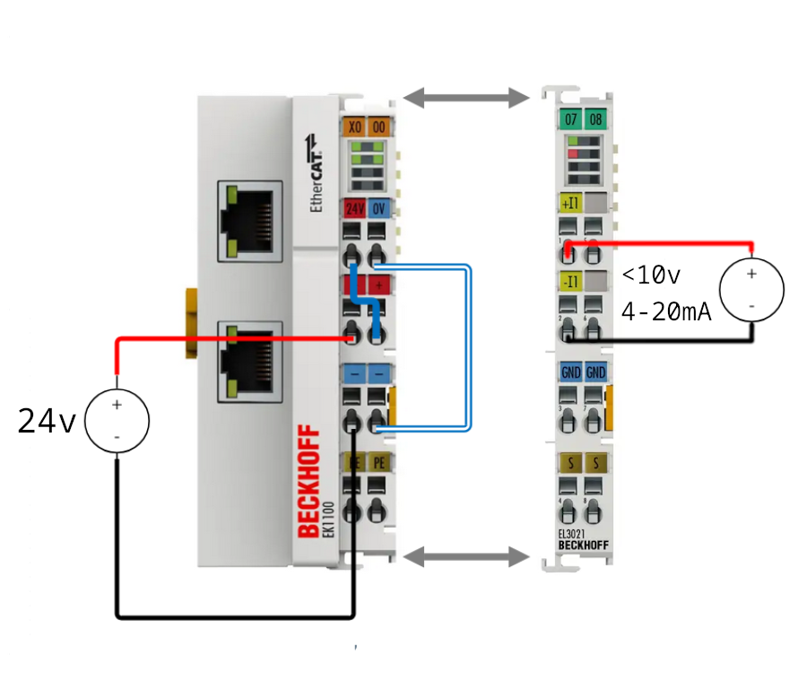
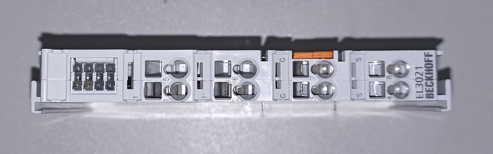
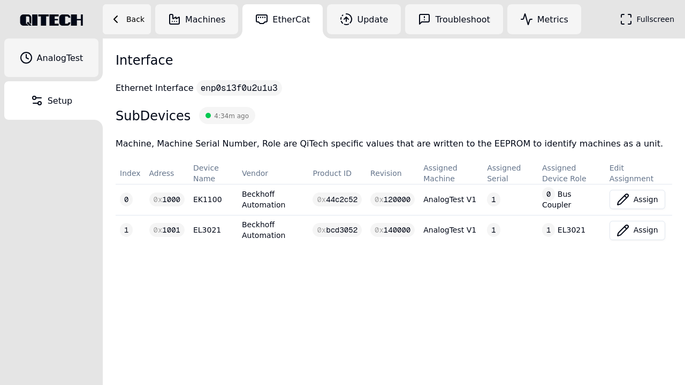
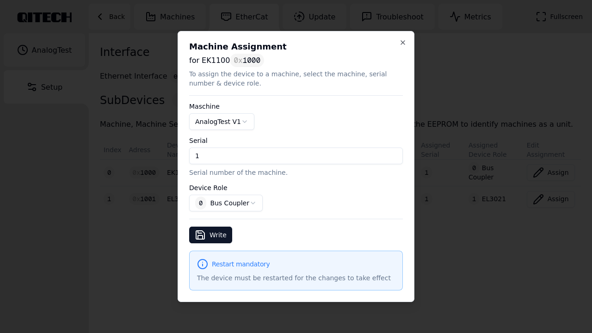
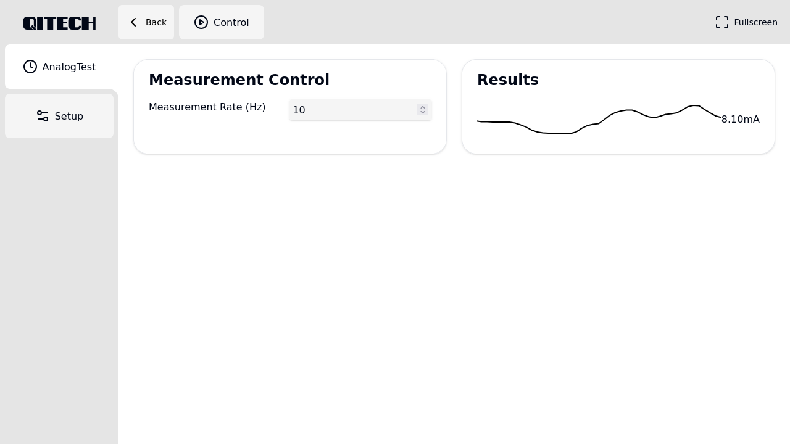

# Minimal Example — Analog Input EL3021

## Table of Contents
1. [Introduction](#1-introduction)
2. [Requirements](#2-requirements)
3. [Hardware Setup](#3-hardware-setup)
4. [Software Setup](#4-software-setup)
5. [Demo](#5-demo)
6. [References](#6-references)

## 1. Introduction
The EL3021 Analog Input example demonstrates how to measure analog current on a **Beckhoff EL3021 EtherCAT terminal** using the QiTech machine framework.

## 2. Requirements

### Hardware
- Beckhoff **EL3021 EtherCAT Terminal** (1-channel analog input)  
- Beckhoff **EK1100 EtherCAT Coupler**
- **24 V DC power supply** (AC/DC adapter + DC hollow plug)
- **Adjustable DC power supply** (or any other means of producing 4-20mA DC @ <10V )
- Jumper / bridge wires (0.5–1.5 mm² recommended)  
- A **Linux PC** (Ubuntu/Debian recommended)  
- Standard Ethernet cable  
- Flat screwdriver  

## 3. Hardware Setup

### 3.1 Schematic

The 24V supply powers the EL2004, while the adjustable power supply generates the analog input signal for the EL3021.

#### ⚠️ Safety Warning  
Always disconnect power before wiring.  
Working on live EtherCAT terminals can cause serious damage or electrical shock.

### 3.2.1 Safe Wiring Procedure (Beckhoff Recommended)

1. Insert a screwdriver **straight** into the square release hole.  
2. Insert the stripped wire into the round opening.  
3. Remove the screwdriver — the spring clamp locks the wire.


---

### 3.2.2 Wiring Steps (Used in This Example)

We supply power using a **DC hollow-plug adapter**, like this one:  
https://www.amazon.de/dp/B093FTFZ8Q

Perform the following wiring on the EK1100:

1. Red wire **(+24 V)** → Terminal **2**  
2. Black wire **(0 V)** → Terminal **3**  
3. Jumper wire from **Terminal 1 → Terminal 6**  
4. Jumper wire from **Terminal 5 → Terminal 7**  

After wiring, your module should look like **Figure 1**.

---

#### **Figure 1 — EK1100 Minimal Wiring**


---

### 3.3 EL3021 Integration

Slide the EL3021 onto the **right side of the EK1100** until it locks.  
The EtherCAT E-Bus and power contacts connect automatically.
Then you need to wire the adjustable power supply to the EL3021.

#### **Figure 2 — EL3021 Terminal**


1. Wire ⊕ to **Terminal 1**
2. Wire ⊖ to **Terminal 2**
---

### 3.4 Final Assembled Setup

#### **Figure 3 — EK1100 + EL3021 Connected**


---

## 3.5 Power & Ethernet

### 3.5.1 Power  
Connect the 24 V adapter to the hollow plug used earlier.

#### Example AC/DC Adapter (Figure 4):


### 3.5.2 Ethernet  
Use a standard LAN cable to connect your PC → EK1100.
The final powered up and connected setup should look like this:


---

## 4. Software Setup

### 4.1 Installing on Ubuntu/Debian

Paste this into your terminal:

```bash
# Press Enter when prompted
curl --proto '=https' --tlsv1.2 -sSf https://sh.rustup.rs | sh

sudo apt update
sudo apt install -y npm nodejs git

git clone git@github.com:qitechgmbh/control.git
cd control/electron
npm install
```
### 4.2 Running the Backend
```bash
./cargo_run_linux.sh
```
This script:

- Builds the backend

- Grants required system capabilities (raw sockets)

- Starts EtherCAT communication

Ensure the EK1100 is connected.

### 4.3 Running the Frontend
```bash
cd electron
npm run start
```
This launches the QiTech Control dashboard.

## 5. Demo

### 5.1 Assigning Devices in the Dashboard
Once both backend and frontend are running, the Setup -> EtherCat page should look something like this:

Listing the EK1100 and the EL3021.

To assign the two devices to a machine, click "Assign" on both devices. This should open the following pop-up modal:

**EK1100**

1. Select "AnalogTest V1" under "Machine"
2. Choose a serial number to uniquely identify the machine (1 in this example)
3. Under "Device Role" select "0 - Bus Coupler"

**EL3021**

1. Select "AnalogTest V1" under "Machine"
2. Use the same serial number you chose for the EK1100
3. Under "Device Role" select "1 - EL3021"
---
The machine is now configured.
A new Tab "AnalogTest" should appear in the right sidebar. Clicking that tab should show the machine control interface:

Results should show the current measured by the analog input - the current set on the adjustable power supply.


## 6. References
This guide incorporates information from official Beckhoff documentation.
All diagrams, product names, and figures belong to Beckhoff Automation GmbH & Co. KG and are used here solely for educational purposes.

Referenced Manuals

[Beckhoff EK1100 Documentation](https://download.beckhoff.com/download/Document/io/ethercat-terminals/ek110x_ek15xx_en.pdf)
[Beckhoff EL3021 Documentation](https://download.beckhoff.com/download/Document/io/ethercat-terminals/el30xx_de.pdf)
