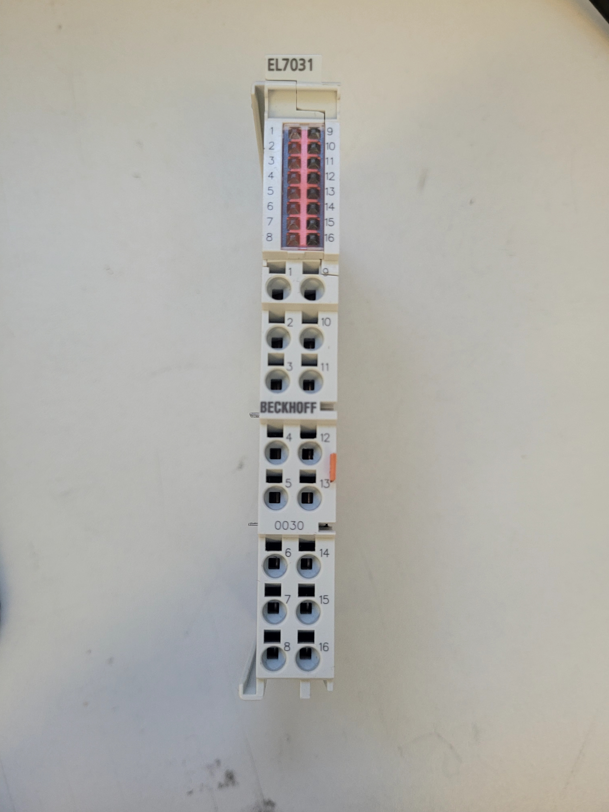
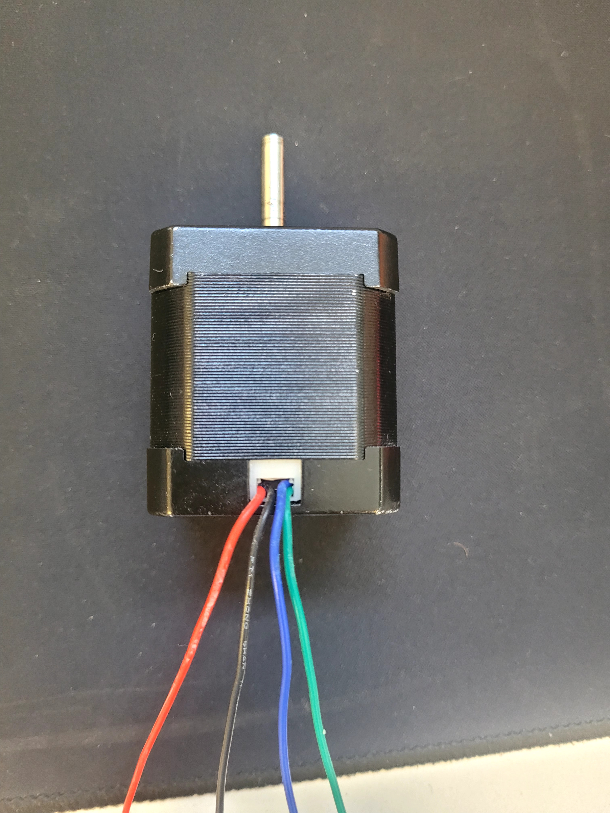
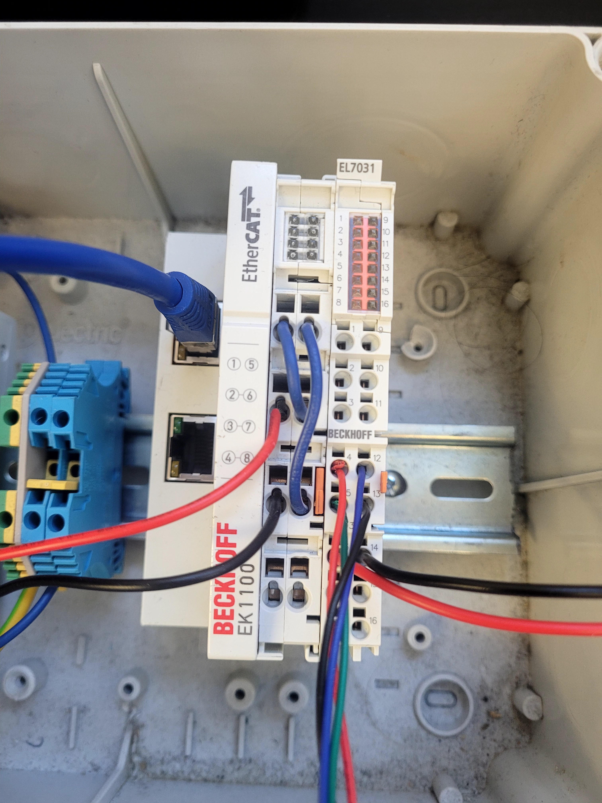
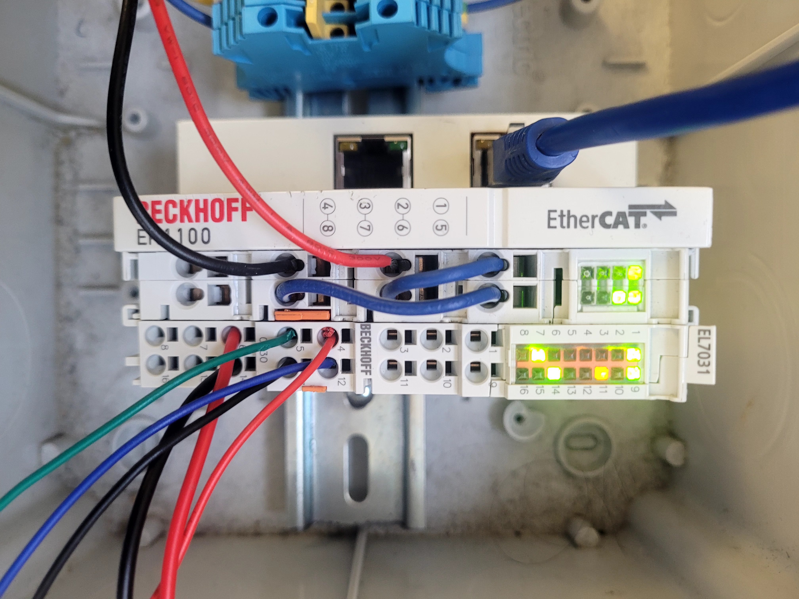
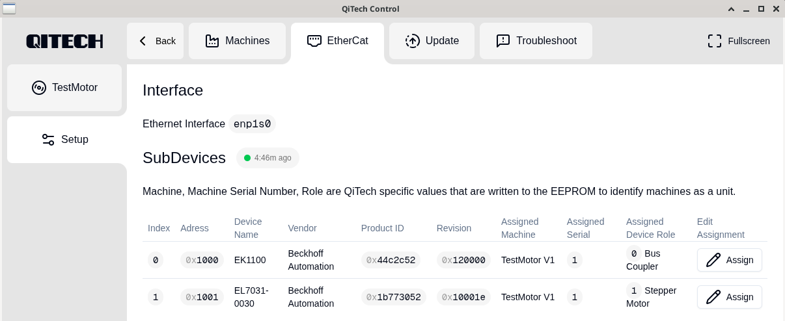
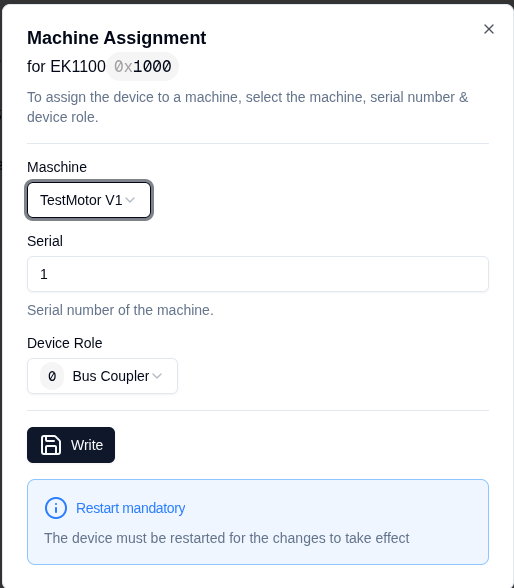
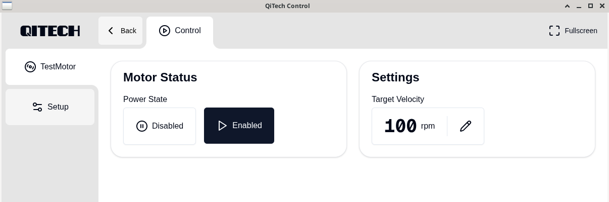

# Minimal Example — Beckhoff EL7031-0030 Stepper Motor Integration  
A complete hardware + software walkthrough

---

## Table of Contents
1. [Introduction](#1-introduction)
2. [Requirements](#2-requirements)
3. [Hardware Setup](#3-hardware-setup)
   - [3.2 EK1100 Wiring](#32-ek1100-wiring)
   - [3.2.1 Safe Wiring Procedure](#321-safe-wiring-procedure-beckhoff-recommended)
   - [3.2.2 Wiring (EL7031-0030)](#322-wiring-el7031-0030)
   - [3.3 Safety Warning](#33--safety-warning)
4. [Software Setup](#4-software-setup)
   - [4.1 Installing on Linux](#41-installing-on-linux-this-depends-on-your-distro)
   - [4.2 Running the Backend](#42-running-the-backend)
   - [4.3 Running the Frontend](#43-running-the-frontend)
5. [Demo](#5-demo)
   - [5.1 Assigning Devices in the Dashboard](#51-assigning-devices-in-the-dashboard)
6. [Documentation](#6-documentation)
7. [Software Architecture](#7-software-architecture)

---

## 1. Introduction

This project documents the successful integration of a **Beckhoff EL7031-0030 Stepper Motor Terminal** into the QiTech control software stack. 
The goal was to control a 24V stepper motor via EtherCAT using a custom Rust backend and a React/Electron frontend.

---

## 2. Requirements

### Software
- Rust toolchain
- Node.js + npm
- Git
- QiTech Control repository
- EtherCAT HAL (included inside repo)

### Hardware
- **EtherCAT Master:** Linux PC
- **Bus Coupler:** EtherCAT Beckhoff EK1100
- **Stepper Driver:** Beckhoff EL7031-0030 (THIS IS DIFFERENT FROM EL7031)
- **Motor:** Standard 4-wire Stepper Motor
- **Power Supply:** 24V DC
- **Ethernet Cable:** Standard Ethernet cable
- **Wiring Tools:** Screwdriver, wires

---

## 3. Hardware Setup

### 3.2 EK1100 Wiring

This wiring configuration powers the EL7031-0030.  
It is not the only possible wiring but is the **simplest functional setup**.

#### ⚠️ Safety Warning
Always disconnect power before wiring.  
Working on live EtherCAT terminals can cause serious damage or electrical shock.

---

#### 3.2.1 Safe Wiring Procedure (Beckhoff Recommended)

1. Insert a screwdriver **straight** into the square release hole.
2. Insert the stripped wire into the round opening.
3. Remove the screwdriver — the spring clamp locks the wire.


---

We supply power using a **DC hollow-plug adapter**, like this one:  
https://www.amazon.de/dp/B093FTFZ8Q

Perform the following wiring on the EK1100:

1. Red wire **(+24 V)** → Terminal **2**
2. Black wire **(0 V)** → Terminal **3**
3. Jumper wire from **Terminal 1 → Terminal 6**
4. Jumper wire from **Terminal 5 → Terminal 7**

After wiring, your module should look like **Figure 1**.

---

#### **Figure 1 — EK1100 Minimal Wiring**


---

#### **Figure 2 — EL7031-0030 Terminal**



Slide the EL7031-0030 onto the right side of the EK1100 until it locks.
The EtherCAT E-Bus and power contacts connect automatically — **no wiring required**.

---

#### **Figure 3 — Motor**


---

#### **Figure 4 — Motor Wiring**


Now the motor is wired via the pins 4, 5, 12, 13 on the EL7031-0030.

---

#### **Figure 5 — EL7031 Integration Connected**



That's what the pin should look like.

---

### 3.2.2 Wiring (EL7031-0030)

**Crucial:** The EL7031 requires two power sources: E-Bus (side contacts) for logic, and Front Terminal (6 & 14) for motor power.

| Terminal Point | Function         | Cable Color (Example) |
| :------------- | :--------------- | :-------------------- |
| **4**          | Motor Coil A1    | Red                   |
| **12**         | Motor Coil A2    | Blue                  |
| **5**          | Motor Coil B1    | Green                 |
| **13**         | Motor Coil B2    | Black                 |
| **6**          | **Power +24V**   | PSU Red (+)           |
| **14**         | **Power 0V/GND** | PSU Black (-)         |

---

### 3.3 ⚠️ Safety Warning

- **Mandatory Power Supply:** Without 24V connected to **Pin 6 (+24V)** and **Pin 14 (GND)**, the terminal will remain in `PREOP` state or show a "Warning" LED (No Power). The motor will **not** move without this external supply.

#### Risk of Destruction (Short Circuit):
- **Never** connect the 24V Power Supply to the Motor Output pins (**4, 5, 12, 13**). This will instantly destroy the terminal (causing pins 12 & 13 to glow red/burn).
- Ensure strict separation: **Pins 4/5/12/13 are for the MOTOR ONLY**.
- **Pins 6/14 are for POWER ONLY**.

Also, see the documentation of the EtherCAT terminal ([EL7031-0030](https://download.beckhoff.com/download/document/io/ethercat-terminals/el7031-0030de.pdf)) for the different power modes (page 46 ff.)

---

## 4. Software Setup

### 4.1 Installing on Linux (this depends on your distro)

Paste this into your terminal:

```bash
# Press Enter when prompted
curl --proto '=https' --tlsv1.2 -sSf https://sh.rustup.rs | sh

sudo apt update
sudo apt install -y npm nodejs git

git clone git@github.com:qitechgmbh/control.git
cd control/electron
npm install
```

### 4.2 Running the Backend

```bash
./cargo_run_linux.sh
```

This script:
- Builds the backend
- Grants required system capabilities (raw sockets)
- Starts EtherCAT communication

### 4.3 Running the Frontend

```bash
# move to the control directory
cd electron
npm run start
```

This launches the QiTech Control dashboard.

---

## 5. Demo

### 5.1 Assigning Devices in the Dashboard

Once the backend + frontend are running, you should see:



Make sure that under "Assign" → "Machine Assignment"
the correct serial number is selected (each device should have the same one, here it is 1).
Under "Machine" select your new Machine however you named it (I named it "TestMotor V1"), else it will detect that there is something connected to it but the connection won't work.



**NOW THE MOTOR SHOULD TURN!**

In the interface "TestMotor" on the left side, you can now control the motor (its state and its speed).



---

## 6. Documentation

Use the official documentation of the EL7031-0030 for more information:  
[Beckhoff EL7031-0030 Documentation](https://download.beckhoff.com/download/document/io/ethercat-terminals/el7031-0030de.pdf)

---

## 7. Software Architecture

### Backend (Rust)
Located in [machines/src/motor_test_machine/](/machines/src/motor_test_machine/).

1. **`mod.rs`**: Defines the `MotorTestMachine` struct and holds the state (driver wrapper, enabled state, target velocity).
2. **`api.rs`**: Handles incoming JSON commands from the frontend (Enable/Disable, Set Velocity) via WebSockets/SocketIO.
3. **`act.rs`**: The real-time control loop. It updates the `StepperVelocityEL70x1` driver wrapper in every cycle based on the current state.
4. **`new.rs`**: Initializes the hardware.

### Frontend (TypeScript/React)
Located in [electron/src/machines/motor_test_machine/](/electron/src/machines/motor_test_machine/) and [electron/src/routes/routes.tsx](/electron/src/routes/routes.tsx).

1. **`useTestMotor.ts`**: Custom hook managing the optimistic state and communication with the backend.
2. **`TestMotorControlPage.tsx`**: The UI using QiTech UI components (`ControlCard`, `EditValue`, `SelectionGroupBoolean`) to match the look and feel of the Winder2.
3. **Routing**: Integrated into `routes.tsx` using TanStack Router, ensuring the machine appears in the sidebar and navigation works correctly.
