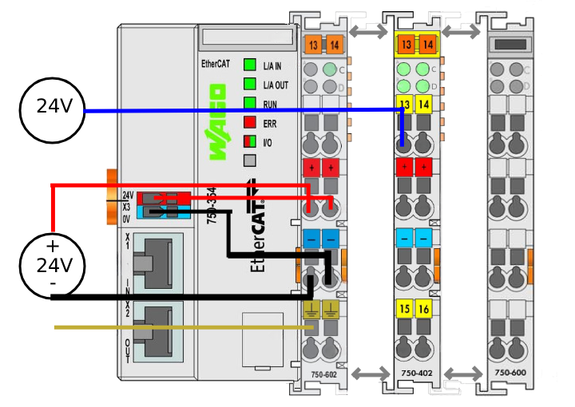
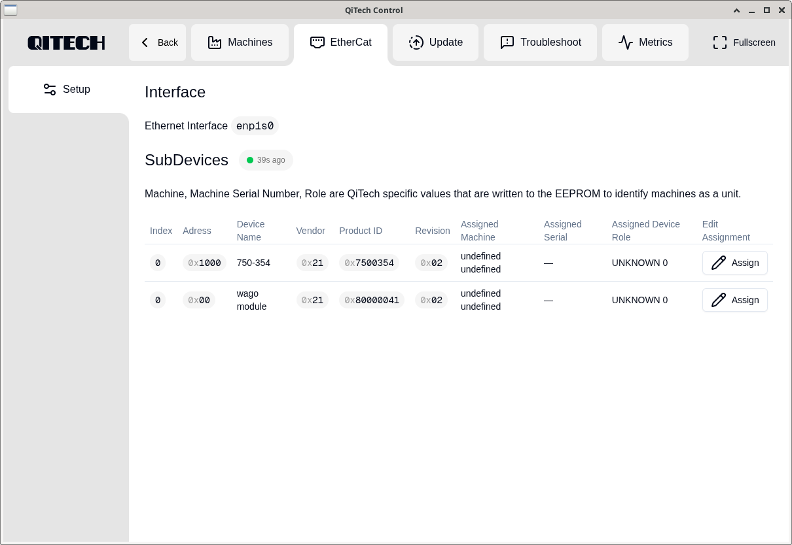
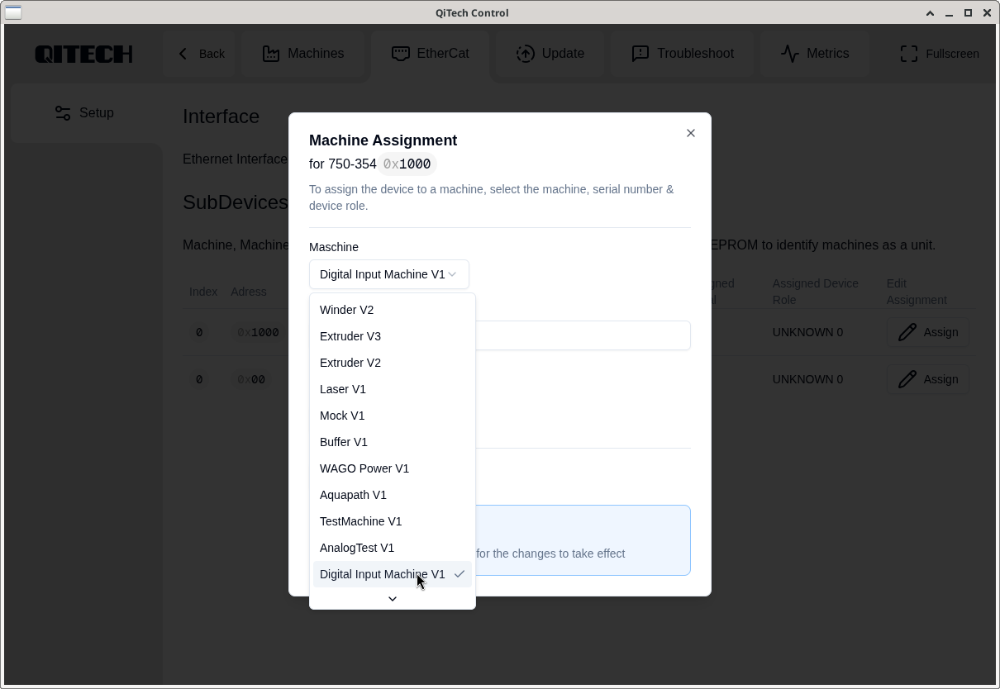
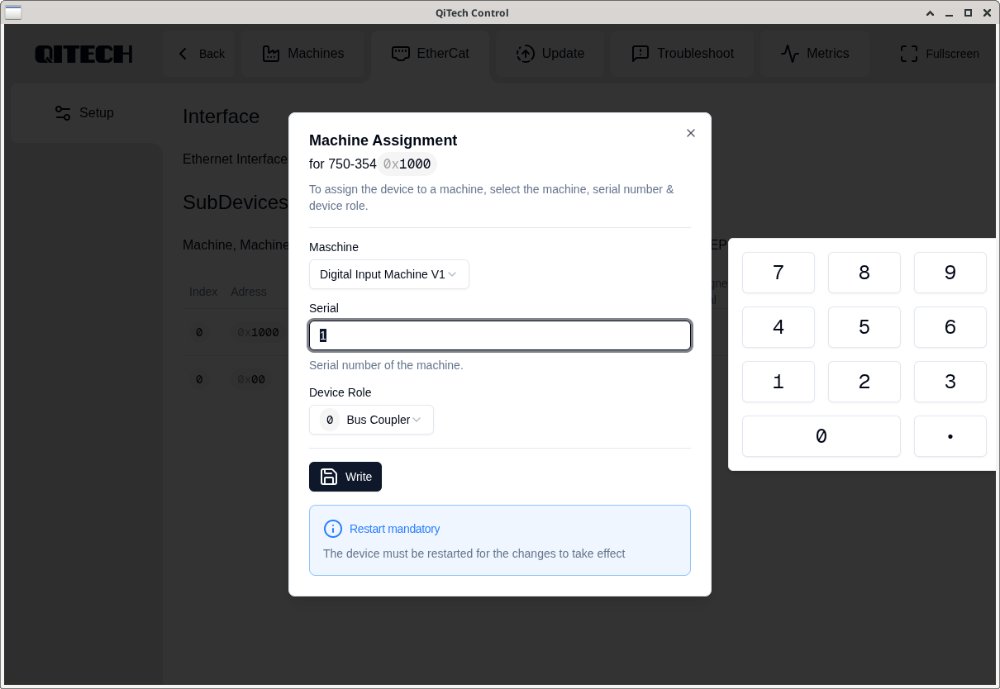
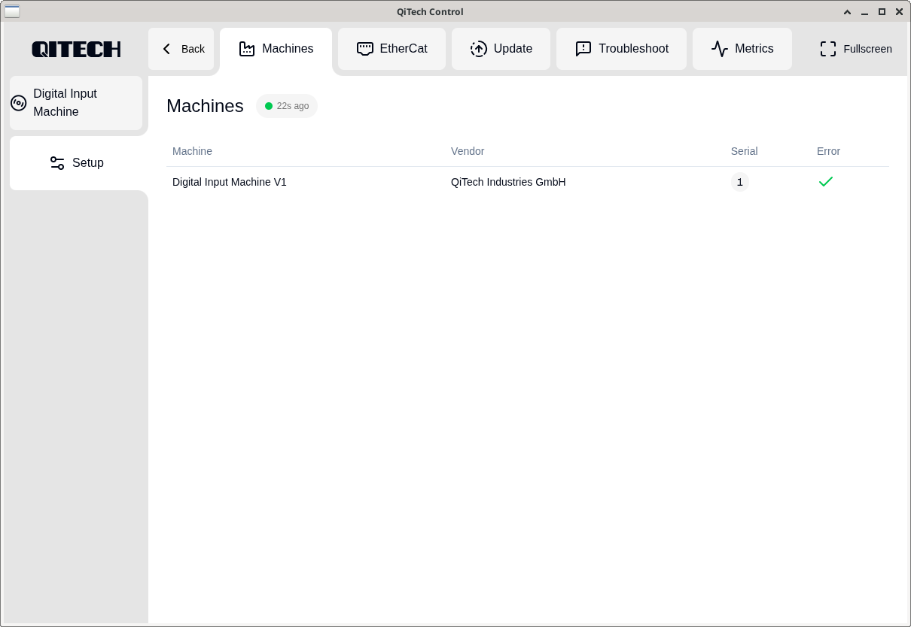
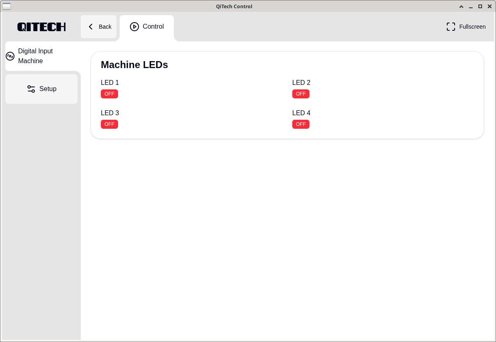
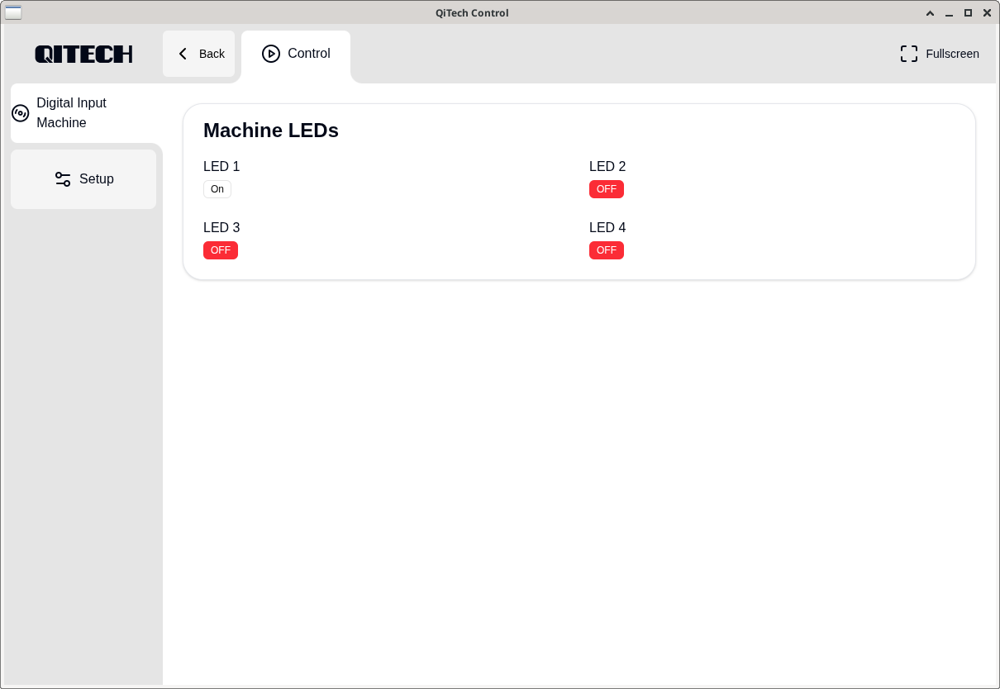

# Minimal Example — LED Control on the WAGO750-402
A complete hardware + software walkthrough

---

## Table of Contents
1. [Introduction](#1-introduction)
2. [Requirements](#2-requirements)
3. [Hardware Setup](#3-hardware-setup)
4. [Software Setup](#4-software-setup)
5. [Demo](#5-demo)
6. [References](#6-references)

---

## 1. Introduction
The WAGO 750-402 Display Example is a minimal demonstation showing how to display the digital inputs on a WAGO 750-402 EtherCAT terminal using the QiTechmachine framework.
It represents the simplest possible hardware interaction in the system:
Displayung the LED Inputs using the QiTech Control Dashboard.
## 2. Requirements

### Hardware
- WAGO **2787-2144 EtherCAT**
- WAGO **750-354 EtherCAT Coupler**
- WAGO **750-602 EtherCAT Power Terminal**
- WAGO **750-402 EtherCAT Terminal** (4.channle digital input)
- WAGO **750-600 EtherCAT Endmodule**
- WAGO **852-1322 Ethernet-Switch**
- **24V DC Lab power supply**(AC/DC adapter)
- A **Linux PC** (Ubuntu/Debian recommended)  
- Standard Ethernet cable  
- Flat screwdriver  


---

### Software
*(Installation steps in Section 4)*

- Rust tollchain
- Node-js + npm
- Git
- QiTech Control repository
- EtherCAT HAL *(include inside repo)*

## 3. Hardware Setup

### 3.1 Schematic



---

#### ⚠️ Safety Warning  
Always disconnect power before wiring.  
Working on live EtherCAT terminals can cause serious damage or electrical shock.

### 3.2.1 Safe Wiring Procedure (Beckhoff Recommended)
1. Insert a screwdriver **straight** into the square release hole.  
2. Insert the stripped wire into the round opening.  
3. Remove the screwdriver — the spring clamp locks the wire.


---

### 3.2.2 Wiring Steps (Used in This Example)

We supply power to the other devices by using the **750-602 EtherCAT Power Terminal**

Perform the following wiring on the Ethernet-Switch:

1. Red wire (+24V) → PWR+
2. Black wire (0V) → RPS-
 
#### **Figure 1 —**


---

### 3.3 WAGO Wiring the Coupler

Wire the **750-354 EtherCAT Coupler** for the power supply
1. red wire (+24V)
2. yellow (0V)

#### **Figure 2 —**


---

### 3.4 750-602 EtherCAT Power Terminal Integration

Slide the **750-602 EtherCAT Power Terminal** onto the **right side of the 750-354 Coupler** until it locks.

Next We need to wire the EtherCat Power Terminal

Perform the next wiring Steps:

1. Green wire (Ground) → **Terminal4**
2. Red wire (+24V) from  **750-602 EtherCAT Power Terminal** → **Terminal 2**
3. Black wire(0V) from **750-602 EtherCAT Power Terminal** → **Terminal 3**
4. Red wire (+24V) from **750-354 EtherCAT Coupler** → **Terminal 6**
5. Yellow wire (0V) from **750-354 EtherCAT Coupler** → **Terminal 7**

#### **Figure 3 — Wiring**


---

## 3.5 750-402 EtherCAT Terminal Integration

Slide the **750-402 EtherCAT Terminal** onto to **right side of the 750-602 EtherCAT Power Terminal** until it locks.

Wire from the **24V DC Lab Adapter** → **Terminal 1**

#### **Figure 4 — Wiring**


## 3.6 750-600 Final Assemly

Slide the **750-600 EtherCAT Endmodule** onto to **right side of the 7750-402 EtherCAT Terminal** until it locks.

No wiring is required

#### **Figure 5 — 750-402 + 750-600 Connected**


## 3.7 Power & Etherneet 

### Power

Connect the 2787-2144 EtherCAT to the power outlet

### Ehternet

Use a standard LAN cable to your PC → **852-1322 Ethernet-Switch** 

And another from **852-1322 Ethernet-Switch** → **750-354 EtherCAT Coupler**

#### **Figure 6 — Ethernet**


## 4. Software Setup

### 4.1 Installing on Ubuntu/Debian
Paste this into your terminal:

```bash
# Press Enter when prompted
curl --proto '=https' --tlsv1.2 -sSf https://sh.rustup.rs | sh

sudo apt update
sudo apt install -y npm nodejs git

git clone git@github.com:qitechgmbh/control.git
cd control/electron
npm install
```
### 4.2 Running the Backend
```bash
./cargo_run_linux.sh
```
This script:

- Builds the backend

- Grants required system capabilities (raw sockets)

- Starts EtherCAT communication

Ensure the WAGO750-402 is connected.

### 4.3 Running the Frontend
```bash
cd electron
npm run start
```

This launches the QiTech Control dashboard.

## 5. Demo

### 5.1 Assigning Devices in the Dashboard

Once the backend + frontend are running, you should see:

- WAGO750-354 (Coupler)

- wago module (Digital Input Terminal)



Steps:

- Click Assign on the wago module

- Select Digital Input Machine V1
 



- Enter a serial number except for 0



- Click Write

### 5.2 Diyplaying LED
Navigate to:

Machines → DigitalInputMachine



You will see this interface:



Now you can apply a Voltage of the Range of 15V-30V (+24V recommended) from the DC lab power supply to the Terminal.
The Terminal can read the digital input, which is signaled by the LED on the Terminal and should be displayes in the Control software.

it schould light up the First LED



## 6. References
This guide incorporates information from official WAGO documentation.
All diagrams, product names, and figures belong to Beckhoff Automation GmbH & Co. KG and are used here solely for educational purposes.

Referenced Manuals

[WAGO 750-402 Documentation](https://www.wago.com/de/io-systeme/4-kanal-digitaleingang/p/750-402#downloads)

[WAGO 750-354 Documentation](https://www.wago.com/de/io-systeme/feldbuskoppler-ethercat/p/750-354#details)

[WAGO 750-602 Documentation](https://www.wago.com/de/io-systeme/potentialeinspeisung/p/750-602#details)

[WAGO 750-354 Documentation](https://www.wago.com/de/io-systeme/endmodul/p/750-600#details)