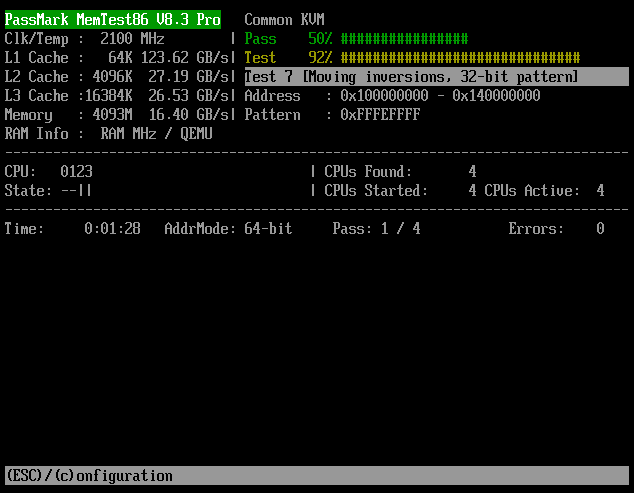

# Testing Ram and Cpu (Hardware)

There were instability problems on one of the hmi panel pc's related to ram.

To test Ram and Cpu for stability problems we use memtest86.

You can download it here: https://www.memtest86.com/download.htm
Then in the unzipped folder you have to flash the .img file to a USB drive with atleast 2GB of space.
We already have USB-Sticks flashed with memtest though.

1. When starting up the Pc mash Del (Entf in german) on an external keyboard and enter the bios

2. Select the Memtest86 usb stick in the Bios

3. Save changes and exit

4. Now memtest boots up, just let it do its thing from here

It works if the screen looks something like this:

Simply let it do one Pass ~20 minutes and shutdown and unplug usb stick afterwards

If it freezes completely -> unstable

If it shows errors the ram should be swapped out and the test repeated
