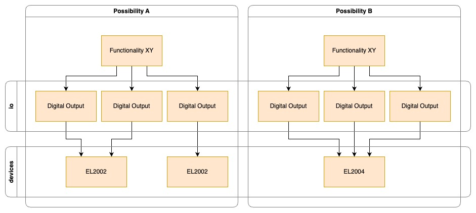

# IO Types
The IO abstraction types create a device-agnostic interface between the machine logic and the devices.
With this possibility, different functionalities can be virtually routed to different devices if they match the IO type.



A hypothetical functionality "XY" needs three digital outputs. On a logical level, it's not important which devices these are; they just have to be digital output devices.
The digital output devices can still have different electrical characteristics which might be important for the application but are not relevant for the machine logic, like direct drive or relay.

A functionality can be virtually wired to any device that matches the IO type. Either to one EL2004 which has 4 digital outputs or to two EL2002 which have 2 digital outputs each. Also, different functionalities can be wired to the same device without interacting with each other.

Functionalities of different machines should not be wired to the same devices because of possibly conflicting configuration and machine identification issues (which devices belong to what machine).

The IO types provide direct synchronous methods for interacting with hardware, eliminating the need for actor patterns while maintaining clean abstractions.

# Implemented IO types

- Digital Output (DO)
- Digital Input (DI)
- Analog Input (AI)
- Analog Output (AO)
- Temperature Input (TI)
- Pulse Train Output (PTO)

# Usage

## Implementing for a device
Since each device has one or multiple ports, it needs to define an enum representing each port/pin.

```rust
#[derive(Debug, Clone)]
pub enum EL2002Port {
    DO1, // Digital Output 1
    DO2, // Digital Output 2
}
```

Then the device must implement the respective device trait like `DigitalOutputDevice`.

The `set_output` method is used to set the desired level of the output of a given port.

The `get_output` method is used to read the current state of the output of a given port.

```rust
impl DigitalOutputDevice<EL2002Port> for EL2002 {
    fn set_output(&mut self, port: EL2002Port, value: DigitalOutputOutput) {
        let expect_text = "All channels should be Some(_)";
        match port {
            EL2002Port::DO1 => self.rxpdo.channel1.as_mut().expect(&expect_text).value = value.into(),
            EL2002Port::DO2 => self.rxpdo.channel2.as_mut().expect(&expect_text).value = value.into(),
        }
    }

    fn get_output(&self, port: EL2002Port) -> DigitalOutputOutput {
        let expect_text = "All channels should be Some(_)";
        DigitalOutputOutput(match port {
            EL2002Port::DO1 => self.rxpdo.channel1.as_ref().expect(&expect_text).value,
            EL2002Port::DO2 => self.rxpdo.channel2.as_ref().expect(&expect_text).value,
        })
    }
}
```

## Using IO types in machine logic

IO types now provide direct synchronous methods for reading and writing values, making them easy to use in machine logic without async/await patterns.

```rust
#[derive(Debug)]
pub struct DigitalOutputToggler {
    output: DigitalOutput,
}

impl DigitalOutputToggler {
    pub fn new(output: DigitalOutput) -> Self {
        Self { output }
    }
    
    pub fn toggle(&mut self) {
        let current_state = self.output.get();
        self.output.set(!current_state);
    }
    
    pub fn turn_on(&mut self) {
        self.output.set(true);
    }
    
    pub fn turn_off(&mut self) {
        self.output.set(false);
    }
}
```

## Getting `DigitalOutput` from a `Device`
With the `new` function of the `DigitalOutput` struct, you can create a new `DigitalOutput` instance from a device and its port. The IO type provides direct synchronous methods for interaction.

```rust
let el2002 = Arc::new(RwLock::new(EL2002::new()));
let digital_output = DigitalOutput::new(el2002, EL2002Port::DO1);
let mut toggler = DigitalOutputToggler::new(digital_output);

// Direct usage
toggler.turn_on();
toggler.toggle();
```

# Creating a new IO type
To create a new IO type, we must know if it's writable (output) or readable (input), or combined (input/output) type.

For output types, we define the struct with sync closures for setting and getting values:

```rust
pub struct DigitalOutput {
    set_output: Box<dyn Fn(DigitalOutputOutput) -> () + Send + Sync>,
    get_output: Box<dyn Fn() -> DigitalOutputOutput + Send + Sync>,
}
```

For input types, we only need the getter:

```rust
pub struct DigitalInput {
    get_input: Box<dyn Fn() -> Result<DigitalInputInput, anyhow::Error> + Send + Sync>,
}
```

For combined input/output types, we have separate getters for input and output:

```rust
pub struct StepperVelocityEL70x1 {
    set_output: Box<dyn Fn(StepperVelocityEL70x1Output) -> Result<(), Error> + Send + Sync>,
    get_output: Box<dyn Fn() -> Result<StepperVelocityEL70x1Output, Error> + Send + Sync>,
    get_input: Box<dyn Fn() -> Result<StepperVelocityEL70x1Input, Error> + Send + Sync>,
    // ... additional closures as needed
}
```

Next, we need to implement the input and output structs separately.

For a digital output, we only need the output struct:

```rust
/// Output value
/// true: high
/// false: low
#[derive(Debug, Clone)]
pub struct DigitalOutputOutput(pub bool);

impl From<bool> for DigitalOutputOutput {
    fn from(value: bool) -> Self {
        DigitalOutputOutput(value)
    }
}

impl From<DigitalOutputOutput> for bool {
    fn from(value: DigitalOutputOutput) -> Self {
        value.0
    }
}
```

For input types, we define input structs:

```rust
#[derive(Debug, Clone)]
pub struct DigitalInputInput {
    pub value: bool,
}
```

For combined input/output types, we define both structs separately, avoiding the need for state containers.

```rust
pub struct DigitalOutputOutput(pub bool);

impl From<bool> for DigitalOutputOutput {
    fn from(value: bool) -> Self {
        DigitalOutputOutput(value)
    }
}

impl From<DigitalOutputOutput> for bool {
    fn from(value: DigitalOutputOutput) -> Self {
        value.0
    }
}
```

Now we implement the constructor for the IO type. The `new` function takes a device and port and returns the IO instance with sync closures:

```rust
impl DigitalOutput {
    pub fn new<PORT>(
        device: Arc<RwLock<dyn DigitalOutputDevice<PORT>>>,
        port: PORT,
    ) -> DigitalOutput
    where
        PORT: Clone + Send + Sync + 'static,
    {
        // build sync write closure
        let port1 = port.clone();
        let device1 = device.clone();
        let set_output = Box::new(move |value: DigitalOutputOutput| {
            let mut device = block_on(device1.write());
            device.set_output(port1.clone(), value);
        });

        // build sync get closure
        let port2 = port.clone();
        let device2 = device.clone();
        let get_output = Box::new(move || -> DigitalOutputOutput {
            let device = block_on(device2.read());
            device.get_output(port2.clone())
        });

        DigitalOutput {
            set_output,
            get_output,
        }
    }

    /// Set the digital output value
    pub fn set(&self, enabled: bool) {
        (self.set_output)(enabled.into());
    }

    /// Get the current output value
    pub fn get(&self) -> bool {
        let output = (self.get_output)();
        output.into()
    }
}
```

Lastly, we create the device trait that needs to be implemented by devices. The trait methods are simplified and separated by input/output:

```rust
pub trait DigitalOutputDevice<PORT>: Send + Sync
where
    PORT: Clone,
{
    fn set_output(&mut self, port: PORT, value: DigitalOutputOutput);
    fn get_output(&self, port: PORT) -> DigitalOutputOutput;
}
```

For input devices:

```rust
pub trait DigitalInputDevice<PORT>: Send + Sync
where
    PORT: Clone,
{
    fn get_input(&self, port: PORT) -> Result<DigitalInputInput, anyhow::Error>;
}
```

For combined input/output devices:

```rust
pub trait StepperVelocityEL70x1Device<PORT>: Send + Sync
where
    PORT: Clone,
{
    fn set_output(&mut self, port: PORT, value: StepperVelocityEL70x1Output) -> Result<(), Error>;
    fn get_output(&self, port: PORT) -> Result<StepperVelocityEL70x1Output, Error>;
    fn get_input(&self, port: PORT) -> Result<StepperVelocityEL70x1Input, Error>;
    // Additional methods as needed for specific device functionality
    fn get_speed_range(&self, port: PORT) -> SpeedRange;
}
```