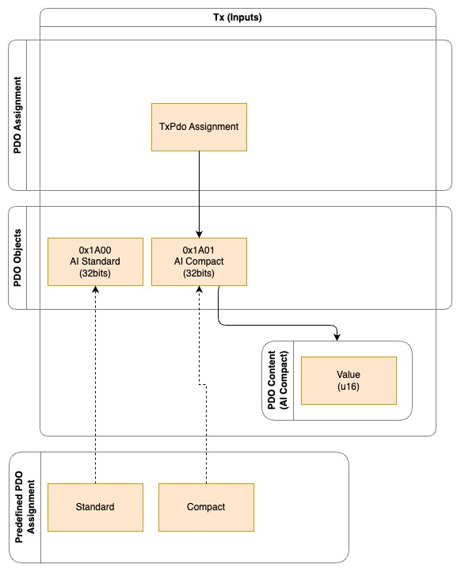
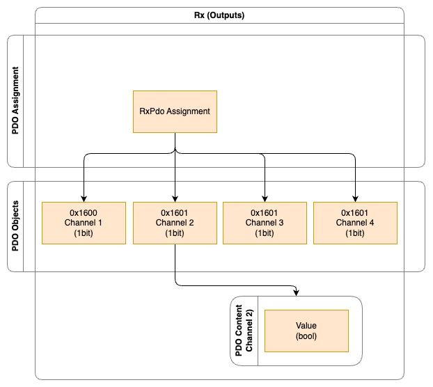
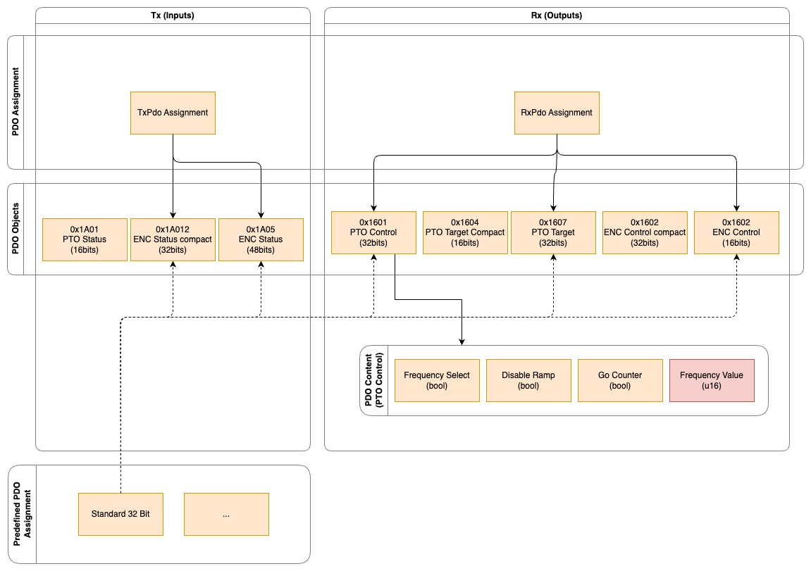

# PDO

Every EtherCAT device has a schema for its process data.

## Structure
### TxPdo / RxPdo

Tx stands for "Transmit" and Rx stands for "Receive".
This is from the perspective of the EtherCAT device.
So TxPdo is used by output devices and RxPdo is used by input devices.
Some devices use both TxPdo and RxPdo.

### PDO Assignment

Some devices (more complex ones) support the configuration of the schema, called **PDO assignment**.
Devices without CoE support have a fixed PDO assignment.

The **PDO Assignment** is a list of **PDO Objects**.

There is a **RxPdo Assignment** and a **TxPdo Assignment**.

### PDO Object

The PDO objects describe the encoding of the data. The content of the **PDO Object** are pointers to variables, but we can ignore this deeper logic since we only need the index (like `0x1A..` for inputs and `0x16..` for outputs) for the PDO assignment. Based on the selected PDO objects we cen implement bitwise encoding and decoding of the data.

There PDO object contents use variables with common variable types which are also available in Rust like `u8`, `u16`, `u32`, `bool`, `f32`, ect. Somtimes class-like data is represented by an `u8` where it makes sense to write a wrapper enum. For example the common `Limit` type which encode four different states (`0x00`, `0x01`, `0x10`, `0x11`) in an `u8`.

Sometimes its also possible to configure the integer signing type of an integer value. Here it makes sense to implement a wrapper and store the value as a raw `u16` wether it unsigned or signed.

### Predefined PDO Assignments

Not all PDO Objects are compatible with each other or redundant. A predefined PDO assignment is a selection of PDO objects that make sense together that can be used as a PDO assignment.

## Examples

This is very abstract, so let's look at an example.

### EL3001

EL3001 is a 1-channel analog input device.

#### Process data overview in TwinCAT


#### Analysis



It just uses the RxPdo assignment.

It has 2 PDO objects:
- AI Standard
- AI Compact

"AI Compact" takes up half the space (2 bytes) of "AI Standard" (4 bytes) since AI Standard contains additional information. AI Compact just provides us with the value we want.

#### Rust Implementation
We can define the TxPdo and RxPdo structs like this. The PDO objects always have to be inside an `Option` even if the device does not support custom assignments.

*ethercat_hal::devices::el3001*
```rust
#[derive(Debug, Clone, TxPdo)]
pub struct EL3001TxPdo {
    #[pdo_object_index(0x1A00)]
    pub ai_standard: Option<AiStandard>,
    #[pdo_object_index(0x1A01)]
    pub ai_compact: Option<AiCompact>,
}

#[derive(Debug, Clone, RxPdo)]
pub struct EL3001RxPdo {}
```

This is how we implement the binary encoding and decoding of the PDO objects.
The decoding can be reverse engineered by looking at the TwinCAT screenshot.

The derive macro `PdoObject`, `TxPdoObject` and the tags `pdo_object_index` and `pdo_object` allow us to know the combined minimum bit size of the assigned PDO objects at runtime.
It also allows us to derive an implementation to write this PDO assignment via SDO to the device.

*ethercat_hal::pdo::el3xx*
```rust
#[derive(Debug, Clone, Default, PdoObject, PartialEq)]
#[pdo_object(bits = 32)]
pub struct AiStandard {
    pub undervoltage: bool,
    pub overvoltage: bool,
    pub limit1: Limit,
    pub limit2: Limit,
    pub error: bool,
    pub txpdo_state: bool,
    pub txpdo_toggle: bool,
    pub value: u16,
}

impl TxPdoObject for AiStandard {
    fn read(&mut self, bits: &BitSlice<u8, Lsb0>) {
        // only read other values if txpdo_toggle is true
        self.txpdo_toggle = bits[8 + 7];
        if !self.txpdo_toggle {
            return;
        }

        self.undervoltage = bits[0];
        self.overvoltage = bits[1];
        self.limit1 = bits[2..4].load_le::<u8>().into();
        self.limit2 = bits[4..6].load_le::<u8>().into();
        self.error = bits[7];
        self.txpdo_state = bits[8 + 6];
        self.value = bits[16..16 + 16].load_le::<u16>();
    }
}

#[derive(Debug, Clone, Default, PdoObject, PartialEq)]
#[pdo_object(bits = 16)]
pub struct AiCompact {
    pub value: u16,
}

impl TxPdoObject for AiCompact {
    fn read(&mut self, bits: &BitSlice<u8, Lsb0>) {
        self.value = bits[0..16].load_le::<u16>();
    }
}
```

Now we can implement the predefined PDO assignment as an `enum`.

*ethercat_hal::devices::el3001*
```rust
#[derive(Debug, Clone)]
pub enum EL3001PredefinedPdoAssignment {
    Standard,
    Compact,
}

impl PdoPreset<EL3001TxPdo, EL3001RxPdo> for EL3001PredefinedPdoAssignment {
    fn txpdo_assignment(&self) -> EL3001TxPdo {
        match self {
            EL3001PredefinedPdoAssignment::Standard => EL3001TxPdo {
                ai_standard: Some(AiStandard::default()),
                ai_compact: None,
            },
            EL3001PredefinedPdoAssignment::Compact => EL3001TxPdo {
                ai_standard: None,
                ai_compact: Some(AiCompact::default()),
            },
        }
    }

    fn rxpdo_assignment(&self) -> EL3001RxPdo {
        match self {
            EL3001PredefinedPdoAssignment::Standard => EL3001RxPdo {},
            EL3001PredefinedPdoAssignment::Compact => EL3001RxPdo {},
        }
    }
}
```

### EL2024

EL2024 is a 4-channel digital output (relay) device.

#### Process data overview in TwinCAT


#### Analysis


It uses the RxPdo assignment and does not support CoE, since no custom assignment and no preferred PDO assignments.

Each PDO object represents a channel output with 1 bit.

#### Rust Implementation

*ethercat_hal::devices::el2024*
```rust
#[derive(Debug, Clone, RxPdo)]
pub struct EL2024RxPdo {
    #[pdo_object_index(0x1600)]
    pub channel1: Option<BoolPdoObject>,
    #[pdo_object_index(0x1601)]
    pub channel2: Option<BoolPdoObject>,
    #[pdo_object_index(0x1602)]
    pub channel3: Option<BoolPdoObject>,
    #[pdo_object_index(0x1603)]
    pub channel4: Option<BoolPdoObject>,
}

impl Default for EL2024RxPdo {
    fn default() -> Self {
        Self {
            channel1: Some(BoolPdoObject::default()),
            channel2: Some(BoolPdoObject::default()),
            channel3: Some(BoolPdoObject::default()),
            channel4: Some(BoolPdoObject::default()),
        }
    }
}
```

*ethercat_hal::devices::el2024*
```rust
#[derive(Debug, Clone, Default, PdoObject)]
#[pdo_object(bits = 1)]
pub struct BoolPdoObject {
    pub value: bool,
}

impl TxPdoObject for BoolPdoObject {
    fn read(&mut self, buffer: &BitSlice<u8, Lsb0>) {
        self.value = buffer[0].into();
    }
}
```

### EL2521

EL2521 is a 1-channel pulse train output device. It can generate digital pulses in different frequencies (not PWM, more like PFM) (output). It also has a counter which counts the pulses generated (input).

#### Process data overview in TwinCAT


#### Analysis


It uses both TxPdo and RxPdo assignment.
The pulse train output, status and encoder status and control is split into different PDO objects. Sometimes there is a compact variant of a PDO object available.

The only predefined PDO assignment we implement here is "Standard 32Bit", since we also skip the other PDO objects.

#### Rust Implementation

*ethercat_hal::devices::el2521*
```rust
#[derive(Debug, Clone, TxPdo)]
pub struct EL2521TxPdo {
    #[pdo_object_index(0x1A01)]
    pub pto_status: Option<PtoStatus>,

    #[pdo_object_index(0x1A05)]
    pub enc_status: Option<EncStatus>,
}

#[derive(Debug, Clone, RxPdo)]
pub struct EL2521RxPdo {
    #[pdo_object_index(0x1601)]
    pub pto_control: Option<PtoControl>,

    #[pdo_object_index(0x1607)]
    pub pto_target: Option<PtoTarget>,

    #[pdo_object_index(0x1605)]
    pub enc_control: Option<EncControl>,
}
```

*ethercat_hal::devices::el2521*
```rust
#[derive(Debug, Clone)]
pub enum EL2521PredefinedPdoAssignment {
    EnhancedOperatingMode32Bit,
}

impl PdoPreset<EL2521TxPdo, EL2521RxPdo> for EL2521PredefinedPdoAssignment {
    fn txpdo_assignment(&self) -> EL2521TxPdo {
        match self {
            EL2521PredefinedPdoAssignment::EnhancedOperatingMode32Bit => EL2521TxPdo {
                pto_status: Some(PtoStatus::default()),
                enc_status: Some(EncStatus::default()),
            },
        }
    }

    fn rxpdo_assignment(&self) -> EL2521RxPdo {
        match self {
            EL2521PredefinedPdoAssignment::EnhancedOperatingMode32Bit => EL2521RxPdo {
                pto_control: Some(PtoControl::default()),
                pto_target: Some(PtoTarget::default()),
                enc_control: Some(EncControl::default()),
            },
        }
    }
}
```

*ethercat_hal::devices::el2521*
```rust
#[derive(Debug, Clone, Default, PdoObject, PartialEq)]
#[pdo_object(bits = 16)]
pub struct PtoStatus {
    pub select_end_counter: bool,
    pub ramp_active: bool,
    pub input_t: bool,
    pub input_z: bool,
    pub error: bool,
    pub sync_error: bool,
    pub txpdo_toggle: bool,
}

impl TxPdoObject for PtoStatus {
    fn read(&mut self, buffer: &BitSlice<u8, Lsb0>) {
        // only read other values if txpdo_toggle is true
        self.txpdo_toggle = bits[8 + 7];
        if !self.txpdo_toggle {
            return;
        }

        self.select_end_counter = buffer[0];
        self.ramp_active = buffer[1];
        self.input_t = buffer[4];
        self.input_z = buffer[5];
        self.error = buffer[6];

        self.sync_error = buffer[8 + 5];
    }
}

#[derive(Debug, Clone, Default, PdoObject, PartialEq)]
#[pdo_object(bits = 48)]
pub struct EncStatus {
    pub set_counter_done: bool,
    pub counter_underflow: bool,
    pub counter_overflow: bool,
    pub sync_error: bool,
    pub txpdo_toggle: bool,
    pub counter_value: u32,
}

impl TxPdoObject for EncStatus {
    fn read(&mut self, bits: &BitSlice<u8, Lsb0>) {
        // only read other values if txpdo_toggle is true
        self.txpdo_toggle = bits[8 + 7];
        if !self.txpdo_toggle {
            return;
        }

        self.set_counter_done = bits[2];
        self.counter_underflow = bits[3];
        self.counter_overflow = bits[4];
        self.sync_error = bits[8 + 5];
        self.counter_value = bits[16..16 + 32].load_le();
    }
}

#[derive(Debug, Clone, Default, PdoObject)]
#[pdo_object(bits = 32)]
pub struct PtoControl {
    pub frequency_select: bool,
    pub disble_ramp: bool,
    pub go_counter: bool,
    pub frequency_value: i32,
}

impl RxPdoObject for PtoControl {
    fn write(&self, buffer: &mut BitSlice<u8, Lsb0>) {
        buffer.set(0, self.frequency_select);
        buffer.set(1, self.disble_ramp);
        buffer.set(2, self.go_counter);

        buffer[16..16 + 16].store_le(self.frequency_value);
    }
}

#[derive(Debug, Clone, Default, PdoObject)]
#[pdo_object(bits = 32)]
pub struct PtoTarget {
    pub target_counter_value: u32,
}

impl RxPdoObject for PtoTarget {
    fn write(&self, buffer: &mut BitSlice<u8, Lsb0>) {
        buffer[0..32].store_le(self.target_counter_value);
    }
}

#[derive(Debug, Clone, Default, PdoObject)]
#[pdo_object(bits = 48)]
pub struct EncControl {
    pub set_counter: bool,
    pub set_counter_value: u32,
}

impl RxPdoObject for EncControl {
    fn write(&self, buffer: &mut BitSlice<u8, Lsb0>) {
        buffer.set(2, self.set_counter);

        buffer[16..16 + 32].store_le(self.set_counter_value);
    }
}
```